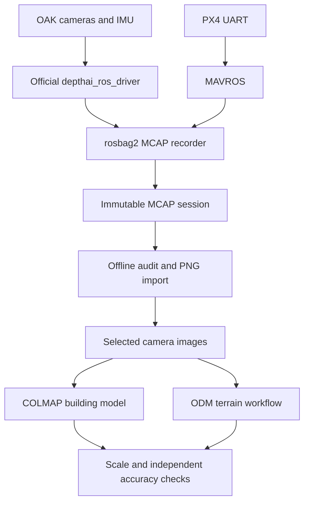

# Architecture and decisions

## Objective and boundary

The first useful deliverable is an auditable OAK-D dataset on Orin Nano: photographs,
inertial measurements, calibration and enough metadata to reprocess later. A failed
capture must be recognizable before leaving the site. Reconstruction runs offline.

The bench uses IMX378 RGB, OV9282 mono cameras and a BNO086 on Orin Nano Super. See the [OAK-D hardware reference](oak-d-hardware.md) for native rates and timing.
Runtime inspection remains mandatory for each device. Standard OAK-D specifications are a reference, not a substitute
for inspecting the connected device [R1](references.md).

## Decisions

| Decision | Reason | Cost / alternative |
|---|---|---|
| Official ROS drivers + rosbag2 MCAP | Proven recording, replay and ROS tooling | ROS headers omit hardware sequence counters and separate IMU timestamps |
| Full-FOV images without rectification | Preserve native geometry for recalibration | More USB bandwidth than encoded video |
| Raw images in indexed MCAP; PNG import offline | Removes image encoding from acquisition | About 4.4 GiB/min at the commissioned settings |
| 200 Hz native gyro (`LINEAR_INTERPOLATE_ACCEL`, accel 250 Hz) and 2 fps images | True gyro timestamps without decimation ([OAK-D reference](oak-d-hardware.md)) | Sample loss at 200 Hz under investigation (#18) |
| Fixed exposure, gain, white balance, focus | Avoid focus-dependent calibration changes and auto-exposure motion blur | Requires tuning to scene lighting/distance |
| Independent camera streams | Preserve unmatched frames and timing evidence | Initial reconstruction uses one camera at a time |
| SfM as primary geometry source | Moving around the scene provides a longer baseline than onboard stereo | Stereo remains useful for near-field experiments |
| Separate finalization and offline acceptance | A closed bag alone does not prove stream health | Inspect required streams, rates and boundary coverage before using it |
| Separate source, export and results | Reprocess without overwriting evidence | Additional disk space, no automatic pruning |

## Current recording components

`deploy/record-rosbag.sh` supervises official nodes and rosbag2, and seals the
result. `bags.py` audits and imports MCAP offline; it never acquires live data.
See [the ROS recording contract](rosbag-recording.md) for current ownership,
storage and timing semantics.

## Offline and legacy SDK components

`oak.py` handles discovery, configuration, hardware timestamps and signals.
`dataset.py` owns images/journals. `validate.py` audits without modifying the source.
`export.py` selects one camera and converts supported lens models. `reconstruct.py`
builds command argument arrays and records external process results. `accuracy.py`
evaluates independent checkpoints without fitting an alignment to them.
`process.py` owns the resumable workflow and stage manifests. `model.py` reads real
COLMAP models and exports poses/quality. `odm.py` prepares calibrated working images,
transforms GCP pixels, checks the pinned engine's camera override, and runs terrain
products. `control.py` validates supplied controls/geolocation. `operations.py`
provides preflight, live capture status and software/machine provenance.
`mavros.py` receives independent ROS telemetry through the existing MAVROS link;
`timing.py` samples clock bridges and qualifies timing evidence.
`telemetry_audit.py` validates preserved messages without ROS;
`association.py` derives exposure-aligned vehicle poses without modifying sources.
`rtcm.py` verifies correction frames and surveyed station coordinates; `ntrip.py`
forwards verified corrections through the existing MAVROS plugin. `gnss_accuracy.py`
interpolates corrected rover positions at exposure and propagates calibrated rig,
base and timing uncertainty. `georeference.py` aligns COLMAP/PLY geometry to metric
projected axes; `map_accuracy.py` reports withheld-checkpoint errors and reference
uncertainty without fitting to the checks. See the [RTK accuracy design](rtk-accuracy.md).

The current adapter assumes CAM_A=RGB, CAM_B=left, CAM_C=right. Missing sockets fail
preflight. Other wiring requires an adapter change. USB 2 and PoE-only transport
are unsupported by this initial full-resolution USB adapter.

## Legacy SDK timing contract

This clock-bridge contract applies to direct-SDK datasets. ROS image imports
explicitly reject this association path until a qualified ROS timing bridge exists.

Image timestamps use the SDK's MIDDLE exposure offset in device and host-synchronized
steady clocks. Host receipt UTC/monotonic values are separate. Bracketed SDK and
ROS clock observations map their independent epochs to Python monotonic time;
receipt UTC is never treated as exposure time.

One OAK supplies a common device clock, but a reboot begins a new session. External
PPS/PTP hardware synchronization is not implemented. The optional PX4 integration
uses the existing MAVROS TIMESYNC estimate with conservative qualification;
see the [full timing review](mavlink-integration.md). Nearest-frame timestamp
offsets do not prove simultaneous exposure. A rolling sensor still has row-dependent
acquisition time even when its frame timestamp matches another camera.

Preserve factory extrinsics in their vendor format. Luxonis camera translation units
are commonly centimetres; verify and explicitly convert before a metre-based rig.
Raw IMU axes are sensor-native, not implicitly camera RDF or vehicle FRD.

## Legacy SDK throughput estimates — not measured performance

For 4056×3040 NV12 RGB plus two 1280×800 GRAY8 images at 2 fps:

`USB payload ≈ 2 × (1.5 × 4056 × 3040 + 2 × 1280 × 800) = 41.1 MB/s`.

Protocol overhead adds to this. Nominal USB 3 capacity does not prove sustained
capture; test the actual sensor modes, cable, hubs and host load. A decoded RGB BGR
array is about 37 MB. Up to 12 queued work items plus device/host queues may consume
hundreds of MB. Test the 4 GB Nano variant especially carefully.

An illustrative disk budget of 5 MB RGB JPEG plus two 1 MB mono PNGs at 2 fps is
14 MB/s, or 50.4 GB/hour. Texture strongly affects compression. Uncompressed RGB+mono
would approach 78 MB/s. Measure representative bytes/time, use an initial 30% capacity
margin and retain the configured 5 GiB free-space reserve. These are engineering
starting values, not hardware guarantees.

## Legacy image/journal failure semantics

An image is encoded, written to a `.partial` file, fsynced, atomically renamed, then
indexed. The directory is fsynced too. Journals are flushed/fsynced periodically and
at clean shutdown. Power loss may leave unindexed images or a torn log tail; those
sessions must not be presented as complete. Backpressure does not prove the sensor
never dropped frames: sequence and observed-interval audits are still required.

SIGINT/SIGTERM stop acquisition and drain accepted work. Device stop, stream stall,
queue overflow, disk/encoding error or sequence reset produces failed status and
nonzero exit. The source queue tail at the requested stop boundary is outside the
accepted interval. Completion means orderly shutdown, not accuracy or no-gap approval.

Filesystem durability also depends on drive caches and power. Regulated power,
cooling, strain relief and shutdown reserve are system responsibilities. This
recorder is not part of a flight-control or safety-critical runtime path.
