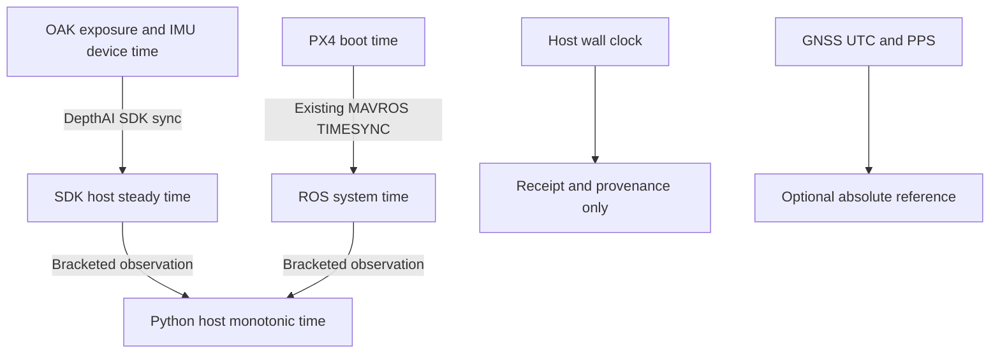

# PX4/MAVROS integration and timing review

This change is stacked on the capture/postprocessing foundation. It uses the
existing MAVROS companion link from `drone_autonomy_platform`; that process owns
TELEM2/UART and MAVLink TIMESYNC. The mapping recorder subscribes through ROS 2.

## Source contracts reviewed

- [Platform PX4 wiring](https://github.com/Darainer/drone_autonomy_platform/blob/bae4cf7ce84fc79fcdd235ee6919c64eca7a0e34/docs/architecture/px4_setup.md): TELEM2 to Orin, nominal `/dev/ttyUSB0` at 921600 baud, existing MAVROS.
- [Survey recorder](https://github.com/Darainer/drone_autonomy_platform/blob/bae4cf7ce84fc79fcdd235ee6919c64eca7a0e34/src/mapping/src/survey_recorder_node.cpp): MAVROS pose/global topics and approximate image/pose pairing.
- [DES-004](https://github.com/Darainer/drone_autonomy_platform/blob/bae4cf7ce84fc79fcdd235ee6919c64eca7a0e34/docs/design/DES-004-survey-dataset-recording.md): 50 ms pairing gate, 200 ms GNSS attachment. These are association windows, not measured synchronization errors.
- [Low-altitude telemetry](https://github.com/Darainer/low_altitude_perception/blob/e5400457441c4ab51cd4e858df2afeccc7e65b71/packages/nano_perception/src/nano_perception/telemetry.py): passive logging, original fields/receipt clocks, no false exposure alignment. This is a useful policy reference; its UDP receiver is not copied into the ROS adapter.
- [MAVROS time conversion](https://github.com/mavlink/mavros/blob/5c68b905ab30de6ce630822dc46c33467e8f23ea/mavros/src/lib/uas_timesync.cpp) and [time plugin](https://github.com/mavlink/mavros/blob/5c68b905ab30de6ce630822dc46c33467e8f23ea/mavros/src/plugins/sys_time.cpp): PX4 boot time plus applied offset becomes ROS time; before convergence it can fall back to receipt time. `TimesyncStatus` publishes an estimate even before that offset is applied. Default convergence window is 500 accepted observations.
- [MAVROS IMU](https://github.com/mavlink/mavros/blob/5c68b905ab30de6ce630822dc46c33467e8f23ea/mavros/src/plugins/imu.cpp): `data_raw` is a ROS sensor report in FLU, not unchanged PX4 FRD or raw silicon packets.
- [MAVROS global position](https://github.com/mavlink/mavros/blob/5c68b905ab30de6ce630822dc46c33467e8f23ea/mavros/src/plugins/global_position.cpp): GNSS altitudes are converted from geoid/AMSL to ellipsoidal height. Do not copy the platform's `alt_amsl` CSV label onto these values.

## Clock chain

Keep OAK device time, SDK host steady time, Python host monotonic time, ROS system
time and PX4 boot time distinct. One Jetson does not eliminate sensor-side clocks.



OAK image time remains the SDK exposure-MIDDLE timestamp. USB receipt time is
separate. The ROS adapter records each original header stamp, receipt clocks,
serialized message and measured ROS-to-monotonic bridge. Pose/IMU ROS headers are
already mapped by MAVROS: applying the PX4 offset to them again would be an error.

The recorder verifies the deployed MAVROS time-plugin parameters and requires
`MAVLINK` mode. A nonzero offset does not prove convergence. A conservative fresh
window of low-RTT, low-residual observations qualifies association; this cannot
prove the unexposed UAS applied-offset state or external timestamp calibration.
Clock jumps, PX4 reboot and transport disconnect invalidate continuity rather than
silently stitching incompatible epochs. Thresholds are engineering settings.

Timing budgets include local sampling brackets, configured SDK allowance, TIMESYNC
RTT/2, observation residual and a PX4 timestamp allowance. These are estimated budgets, not guaranteed error
bounds; transport asymmetry, estimator delay and rolling-shutter row timing still
need bench characterization. Hardware triggers/PPS improve exposure reference;
host NTP/PTP alone does not synchronize shutters.

[MAVROS local pose](https://github.com/mavlink/mavros/blob/5c68b905ab30de6ce630822dc46c33467e8f23ea/mavros/src/plugins/local_position.cpp)
uses `LOCAL_POSITION_NED.time_boot_ms`: converting it to ROS nanosecond units does
not restore sub-millisecond sensor precision. The default PX4 timestamp allowance
is 1 ms; the SDK allowance is also 1 ms. Neither includes unmeasured estimator or
sensor filtering delay.

## What is recorded and associated

The adapter independently subscribes to state, raw ROS IMU, attitude IMU, local
pose, global fix, TIMESYNC status and time reference. Every accepted message keeps
its original header, type, decoded fields and base64 CDR payload in a sealed
`telemetry.jsonl`. OAK IMU reports stay in `imu.jsonl`, with their native device and
SDK timestamps. No inertial fusion, camera extrinsics or flight commands are added.

For an exposure at SDK timestamp `s`, bracketed observations map `s` to Jetson
monotonic time and then ROS system time. `wr-map sync` interpolates local body
position and SLERPs orientation at that exposure. It refuses pose extrapolation.
Already-converted MAVROS headers follow the ROS-to-monotonic bridge directly.
The optional estimated PX4 boot timestamp is `exposure_ros_ns - estimated_offset_ns`;
that offset is **not** applied to pose/IMU headers again.

| Default gate | Meaning |
|---|---|
| 501 consecutive good TIMESYNC messages, or deployed convergence window + 1, whichever is larger | Fresh conservative evidence after recorder startup |
| RTT < min(10 ms, deployed maximum), residual <= 2 ms | Observed versus estimated offset quality |
| Clock bridge age <= 200 ms; TIMESYNC evidence age <= 500 ms | No stale clock conversion |
| Pose before/after exposure each <= 50 ms | Interpolation support, separate from clock quality |
| Estimated alignment budget <= 5 ms | Combined clock gate, separate from pose spacing |
| GNSS nearest sample <= 200 ms, valid finite fix | Optional vehicle-position attachment |
| Any required topic silent > 5 s | Capture fails and accepted records are drained |

A single bad TIMESYNC sample degrades association until a fresh qualification
window is collected. A complete capture needs at least one qualified interval;
individual frames can still be unassociated. `sync` keeps every frame decision
and exits 2 if the selected stream fails `--min-fraction` (default 0.9). It does
not remove original photographs. Required topics are state, IMU raw, pose and
TIMESYNC; optional GNSS/attitude/time-reference absence does not invent samples.
BEST_EFFORT ROS QoS is compatible with sensor publishers; DDS loss before receipt
cannot be counted from ROS headers. Bounded-buffer overflow fails explicitly.

## Jetson operation with the existing platform

Use the integration branch until the stacked PRs merge. The proposed runtime is
ROS 2 Humble with its **Python 3.10** interpreter on Ubuntu 22.04. A Python 3.12
venv cannot load Humble's Python 3.10 binary modules. Install the platform's ROS
and MAVROS packages through its existing deployment, then create a venv which can
see those packages. Match `ROS_DOMAIN_ID` and DDS configuration to MAVROS.

```bash
git switch feat/mavlink-mapping-integration
source /opt/ros/humble/setup.bash
python3 -m venv --system-site-packages .venv
source .venv/bin/activate
python -m pip install --upgrade pip 'setuptools>=68,<80' wheel
python -m pip install -e '.[oak]'
python -c 'import rclpy, mavros_msgs, geometry_msgs, sensor_msgs, rosidl_runtime_py'
ros2 node list
ros2 topic list -t
```

Keep the existing MAVROS process connected to PX4. **Stop the platform's DepthAI
ROS camera driver while this recorder owns the OAK USB device.** There must be
one camera owner and one UART/MAVLink owner. This adapter does not consume
`/oak/rgb/image_raw`; it uses direct camera acquisition to preserve original
exposure and device metadata. Running the two camera owners together will fail.

Copy `configs/mavros-survey.json` to a private deployment config. Set `time_node`
to the actual time-plugin node from `ros2 node list`; `/mavros/time` was verified
in the existing platform's MAVROS 2.14.0 image. Set every topic to the actual absolute
name. The platform's examples and upstream MAVROS namespaces are not uniform.
Inspect the actual node before capture, substituting its name below:

```bash
ros2 param get /mavros/time timesync_mode
ros2 param get /mavros/time convergence_window
ros2 param get /mavros/time max_rtt_sample
ros2 topic echo /mavros/state --once
ros2 topic hz /mavros/timesync_status
ros2 topic hz /mavros/local_position/pose
ros2 topic hz /mavros/imu/data_raw
```

The recorder reads those three parameters through ROS services, requires MAVLINK
mode, and saves the values. It does not change PX4 streams, arm, set flight modes
or write MAVROS parameters. Configure the existing connector to publish the
required topics at appropriate rates before acquisition. Local-position output
requires a usable PX4 estimator; a connected serial link alone is insufficient.

The supplied camera profile warms up for **60 seconds**, allowing roughly 50
seconds for 501 good samples at 10 Hz. This is not a promise of qualification;
lower rates or rejected observations need longer. `--duration 60` means 60 saved
seconds **after** warmup, about two minutes total with this profile. Telemetry and
clock evidence are recorded during warmup; camera and OAK IMU samples are saved
after it. Copy/tune the camera profile for the actual early OAK-D and check
`wr-map inspect`; the exact Kickstarter board IMU has not been hardware-probed.

```bash
wr-map capture --config configs/oakd-mavros-survey.json \
  --telemetry-config configs/mavros-survey.json \
  --output /mnt/nvme/mapping/px4-bench-001 --duration 60
wr-map status /mnt/nvme/mapping/px4-bench-001
wr-map validate /mnt/nvme/mapping/px4-bench-001
```

Offline, ROS is not required for validation or association:

```bash
wr-map sync /data/sessions/px4-bench-001 \
  --output /data/alignment/px4-bench-001 --stream rgb --min-fraction 0.9
```

`associations.jsonl` explains each frame decision; `body-poses.csv` contains only
associated **vehicle body** poses; `report.json` seals outputs and summarizes
coverage and estimated budgets. Use a new output directory. The original session
is unchanged. Reconstruction still uses the building/terrain workflows from the
foundation PR. These body positions are not automatically passed to ODM as camera
centres: camera mounting, lever arm and coordinate transform must first be measured.
GNSS covariance, fix status and height reference remain available for that work.

For unattended capture, customize the foundation service to source the same ROS
and platform overlay and pass `--telemetry-config`. The launcher accepts these through
`WR_MAPPING_ROS_SETUP`, `WR_MAPPING_ROS_OVERLAY`, and `WR_MAPPING_TELEMETRY_CONFIG`
in `/etc/wallering-mapping.env`, and runs a receive-only startup probe first.
See [hardware checks](hardware-acceptance.md) to reuse the local platform container
and review the IMU firmware, loaded timing, GNSS delivery and missing RTK-plugin findings.
Keep startup dependent on the established
MAVROS service, retain unique session names and test service shutdown on the bench.

## Physical timing acceptance

1. Rigidly mount OAK and PX4. Save board IDs, firmware/software versions, exposure,
   stream rates, mounting rotation and lever arm alongside the private dataset.
   Keep the rig stationary first, then make deliberate rotations on each axis.
2. Validate all camera/OAK-IMU/PX4 records and the sync report under the intended
   USB, storage and companion-compute load. Inspect RTT, offset residual, sampling
   brackets, rejected frames and pose coverage across a 20-minute soak. Deliberately
   disconnect/reboot only in a disposable bench capture; continuity must fail.
3. Compare OAK and PX4 gyro signals in the **same physical frame**. Convert each
   OAK SDK report timestamp through the recorded SDK-to-monotonic bridge; convert
   each PX4 IMU ROS header through the ROS-to-monotonic bridge. Fit mounting rotation
   and test residual temporal lag with rich multi-axis motion. Hold out a second
   motion sequence; estimate repeatability and drift, not just one best correlation.
   Do not equate OAK native axes with PX4 FRD or MAVROS FLU. Different filtering,
   rates, vibration and sensor latency can bias a correlation peak.
4. Check camera timestamp/exposure timing with a measured external optical event,
   such as a suitably instrumented flashing LED, or a calibrated visual-inertial
   target experiment. An uninstrumented visual blink is not an absolute reference.
   Characterize RGB row readout separately; a frame midpoint does not align every
   rolling-shutter row. Do not infer shutter timing solely from IMU correlation.
5. Derive an allowable timing budget from flight motion and mapping tolerance.
   For example, 10 m/s times 5 ms is 5 cm of translational motion, before rotation,
   lever-arm, estimator and geolocation errors. The example defaults are not an
   accuracy certification. Update private settings only after measured evidence.

NTP can discipline host wall time, but host clock steps during acquisition cause
failure. Complete any clock correction before starting a session. GNSS
`TimeReference` is recorded separately; it does not establish that camera exposures
were hardware-triggered by PPS. A future trigger/PPS upgrade requires checking the
exact OAK board pins, electrical interfaces and firmware support, then recording
trigger IDs/sample counters and measured delays. No PPS wiring is assumed here.

Automated coverage includes clock conversion, stale/degraded gates, PX4 reset,
interpolation, original-message preservation, shutdown and ROS services/DDS/CDR.
The actual OAK/PX4/Orin path and physical synchronization remain bench acceptance
work; software tests cannot establish their accuracy.
