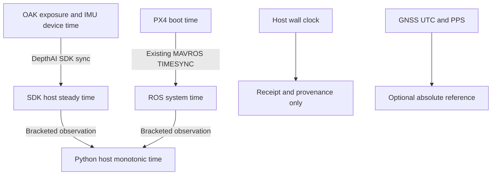

# PX4/MAVROS integration and timing review

This change is stacked on the capture/postprocessing foundation. It uses the
existing MAVROS companion link from `drone_autonomy_platform`; that process owns
TELEM2/UART and MAVLink TIMESYNC. The mapping recorder subscribes through ROS 2.

## Source contracts reviewed

- [Platform PX4 wiring](https://github.com/Darainer/drone_autonomy_platform/blob/bae4cf7ce84fc79fcdd235ee6919c64eca7a0e34/docs/architecture/px4_setup.md): TELEM2 to Orin, nominal `/dev/ttyUSB0` at 921600 baud, existing MAVROS.
- [Survey recorder](https://github.com/Darainer/drone_autonomy_platform/blob/bae4cf7ce84fc79fcdd235ee6919c64eca7a0e34/src/mapping/src/survey_recorder_node.cpp): MAVROS pose/global topics and approximate image/pose pairing.
- [DES-004](https://github.com/Darainer/drone_autonomy_platform/blob/bae4cf7ce84fc79fcdd235ee6919c64eca7a0e34/docs/design/DES-004-survey-dataset-recording.md): 50 ms pairing gate, 200 ms GNSS attachment. These are association windows, not measured synchronization errors.
- [Low-altitude telemetry](https://github.com/Darainer/low_altitude_perception/blob/e5400457441c4ab51cd4e858df2afeccc7e65b71/packages/nano_perception/src/nano_perception/telemetry.py): passive logging, original fields/receipt clocks, no false exposure alignment. This is a useful policy reference; its UDP receiver is not copied into the ROS adapter.
- [MAVROS time conversion](https://github.com/mavlink/mavros/blob/5c68b905ab30de6ce630822dc46c33467e8f23ea/mavros/src/lib/uas_timesync.cpp) and [time plugin](https://github.com/mavlink/mavros/blob/5c68b905ab30de6ce630822dc46c33467e8f23ea/mavros/src/plugins/sys_time.cpp): PX4 boot time plus applied offset becomes ROS time; before convergence it can fall back to receipt time. `TimesyncStatus` publishes an estimate even before that offset is applied. Default convergence window is 500 accepted observations.
- [MAVROS IMU](https://github.com/mavlink/mavros/blob/5c68b905ab30de6ce630822dc46c33467e8f23ea/mavros/src/plugins/imu.cpp): `data_raw` is a ROS sensor report in FLU, not unchanged PX4 FRD or raw silicon packets.
- [MAVROS global position](https://github.com/mavlink/mavros/blob/5c68b905ab30de6ce630822dc46c33467e8f23ea/mavros/src/plugins/global_position.cpp): GNSS altitudes are converted from geoid/AMSL to ellipsoidal height. Do not copy the platform's `alt_amsl` CSV label onto these values.

## Clock chain

Keep OAK device time, SDK host steady time, Python host monotonic time, ROS system
time and PX4 boot time distinct. One Jetson does not eliminate sensor-side clocks.

OAK image time remains the SDK exposure-MIDDLE timestamp. USB receipt time is
separate. The ROS adapter records each original header stamp, receipt clocks,
serialized message and measured ROS-to-monotonic bridge. Pose/IMU ROS headers are
already mapped by MAVROS: applying the PX4 offset to them again would be an error.

The recorder verifies the deployed MAVROS time-plugin parameters and requires
`MAVLINK` mode. A nonzero offset does not prove convergence. A conservative fresh
window of low-RTT, low-residual observations qualifies association; this cannot
prove the unexposed UAS applied-offset state or external timestamp calibration.
Clock jumps, PX4 reboot and transport disconnect invalidate continuity rather than
silently stitching incompatible epochs. Thresholds are engineering settings.

Timing budgets include local sampling brackets, configured SDK allowance, TIMESYNC
RTT/2 and observation residual. These are estimated budgets, not guaranteed error
bounds; transport asymmetry, estimator delay and rolling-shutter row timing still
need bench characterization. Hardware triggers/PPS improve exposure reference;
host NTP/PTP alone does not synchronize shutters.

Implementation and operator commands follow in this stacked PR. Hardware/ROS runtime
acceptance is pending; the development environment has neither rclpy nor a PX4 link.
